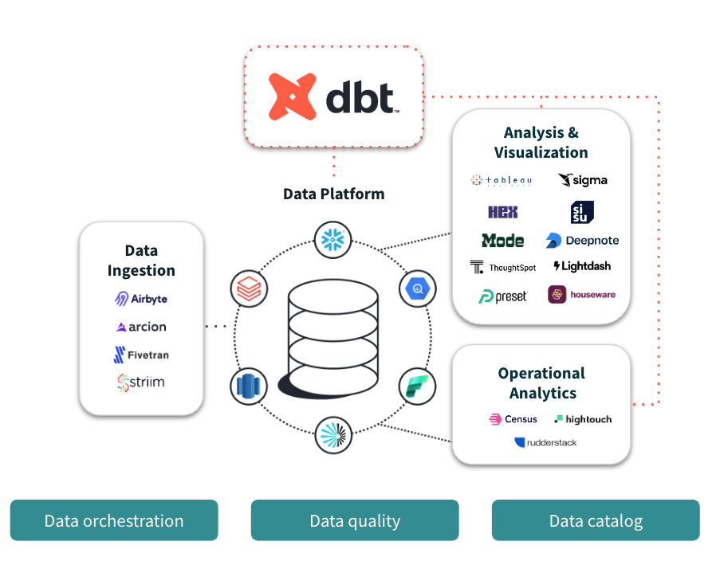

# Bem-vindo

Olá, boas-vindas ao bootcamp de Data warehouse com dbt-core e PostgreSQL na AWS!

A nossa intenção neste curso é facilitar o aprendizado sobre como construir um data warehouse eficiente utilizando dbt-core. Vamos explorar como integrar o dbt-core com o PostgreSQL, criar transformações de dados, e gerar insights valiosos. 

Tudo isso para oferecer uma boa base para quem quer trabalhar com essa tecnologia. A nossa forma de apresentar o curso é prática e cheia de informações, buscando trazer o que você precisa para criar os seus próprios projetos.

## Datas das Aulas

As datas das aulas síncronas (ao vivo e com a turma) já estão disponíveis na [comunidade da jornada de dados ](https://suajornadadedados.com.br/).

## O que é dbt?

dbt é um fluxo de trabalho de transformação focado em SQL que permite que as equipes implantem código de análise de forma rápida e colaborativa, seguindo as melhores práticas de engenharia de software, como modularidade, portabilidade, CI/CD e documentação. Agora, qualquer membro da equipe de dados pode contribuir de forma segura para pipelines de dados em nível de produção.

## Sobre o Bootcamp

Este bootcamp foi desenvolvido para oferecer uma experiência prática no uso do dbt-core, ele é a conclusão do bootcamp de Python para engenheiros e analytics engineer que possui 20 módulos.

Meu objetivo é que você obtenha uma compreensão das funcionalidades do dbt-core e das boas práticas associadas a ele. Que seja capaz de migrar um projeto utilizando comandos DDL e DML para os modelos do dbt

O projeto central do curso será a construção de um data warehouse baseado no banco de dados de demonstração Northwind. Esse projeto incluirá a implementação de transformações de dados, agregações e a criação de relatórios.

Para a construção do projeto, serão utilizadas as versões mais recentes das ferramentas, disponíveis em 2024, como dbt-core e PostgreSQL.

Além da construção do projeto, o curso também incluirá a prática de automação e execução de transformações, utilizando o airflow. Essa abordagem garante que as transformações de dados sejam não apenas funcionais, mas também robustas e confiáveis.

## O que você vai aprender?

Aqui está uma visão geral dos tópicos que abordaremos neste curso:

- **Configurando um Ambiente de Desenvolvimento para dbt-core**: começaremos do absoluto zero, criando e configurando nosso ambiente de desenvolvimento.
- **Primeiros Passos com dbt-core**: após configurar o ambiente, mergulharemos na estrutura básica de um projeto dbt-core e faremos uma introdução detalhada às transformações de dados.
- **Modelagem de Dados com dbt-core**: aprenderemos a criar e manipular modelos de dados, utilizando o dbt-core para transformar e organizar os dados.
- **Integração com PostgreSQL na AWS**: construiremos uma integração completa com o PostgreSQL na AWS, para garantir que nossos dados sejam armazenados e processados de maneira eficiente.
- **Automatizando e Executando Transformações de Dados**: faremos uma introdução detalhada à automação de transformações de dados, garantindo que nossos pipelines de dados sejam robustos e eficientes.

## Pré-requisitos

Para aproveitar ao máximo este curso, é recomendado que você já tenha assistido até a aula 05 do bootcamp de SQL.

- Saber criar uma consulta usando CTE (Common Table Expressions);
- Saber criar tabelas e views;
- Entender joins (INNER JOIN, LEFT JOIN, etc.) e como combiná-los para obter dados de múltiplas tabelas;
- Conhecimento de agregações e funções de janela (window functions) para realizar cálculos complexos sobre conjuntos de dados.